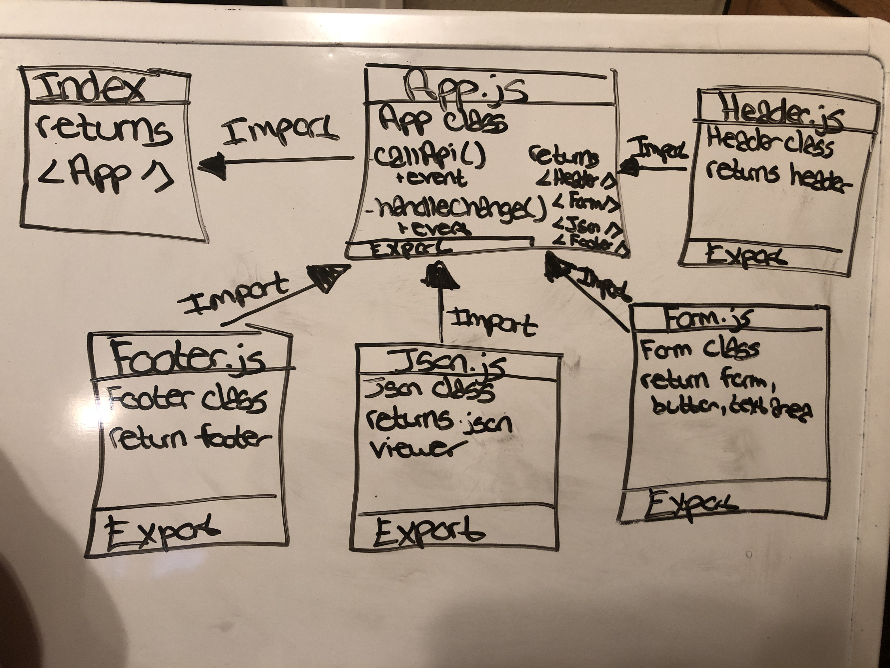

# Lab: RESTy

## Block 5 Project: RESTy

### Author: Tia Rose

### Links and Resources

* [submission PR](https://github.com/tia-rose-401-advanced-javascript/Resty/pull/1)
* [travis](https://www.travis-ci.com/tia-rose-401-advanced-javascript/Resty)
* [codesandbox](https://codesandbox.io/s/resty-8qihc?fontsize=14)
* [netlify](https://zealous-tesla-34fd2f.netlify.com)
* [aws](http://rest-y.s3-website-us-west-2.amazonaws.com)

#### Documentation
`npm run styleguide`

### Modules
#### `App.js`
`callApi(event) -> Gets response back from superagent`
   * Takes an event. Makes a API request to a third-party application.
   * It assings the response and header to the state

`handleChange(event) -> setsState`
   * Handles changes occuring in the form

#### Running the app
* `npm start`
  
#### Tests
* `npm test`

#### UML

